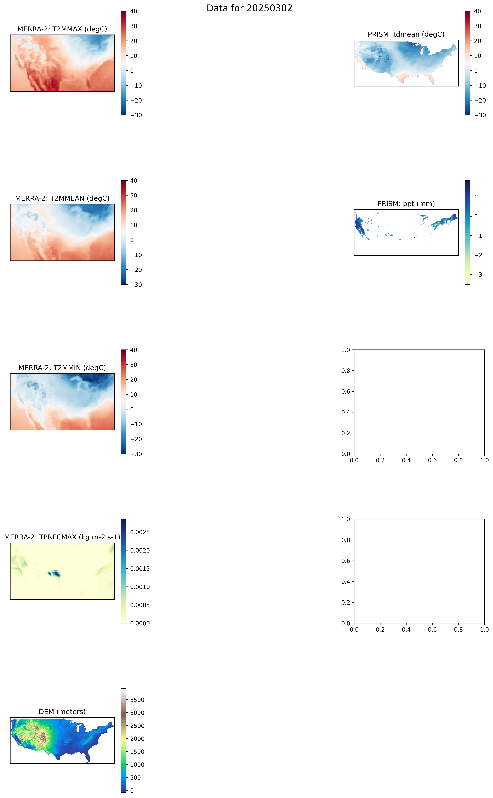

# MERRA-2 to PRISM Downscaling Pipeline

This project implements a PyTorch Lightning pipeline to downscale MERRA-2 climate data to PRISM's higher resolution using the Prithvi WxC foundation model. The pipeline transforms coarse atmospheric variables into high-resolution outputs matching observed PRISM climatology.

## Project Structure

- `data/`: Contains input and auxiliary data
  - `merra2/`: MERRA-2 NetCDF4 files (51x94 grid)
  - `prism/`: PRISM climate data files (621x1405 grid, 4km resolution)
  - `dem/`: Digital Elevation Model data (matching PRISM resolution)

- `src/`: Source code
  - `data/`: Data preprocessing and dataset implementations
    - `preprocessing.py`: Data loading and transformation functions
    - `dataset.py`: PyTorch dataset implementations
  - `models/`: Model architecture definitions
  - `trainers/`: PyTorch Lightning trainer modules
  - `utils/`: Utility functions and helper scripts
  - `config/`: Configuration files
  - `scripts/`: Analysis and visualization scripts
    - `explore_data.py`: Data visualization and analysis tool

## Data Processing

### Input Data
- **MERRA-2 Variables:**
  - T2MMAX: Maximum 2-meter temperature (K → °C)
  - T2MMEAN: Mean 2-meter temperature (K → °C)
  - T2MMIN: Minimum 2-meter temperature (K → °C)
  - TPRECMAX: Maximum precipitation rate
  - Format: NetCDF4
  - Coordinate System: WGS84 (EPSG:4326)

- **PRISM Variables:**
  - tdmean: Mean temperature (°C)
  - ppt: Precipitation (mm)
  - Format: GeoTIFF in zip archives
  - Coordinate System: NAD83 (EPSG:4269)

- **Auxiliary Data:**
  - Digital Elevation Model (DEM)
  - Format: BIL (Band Interleaved by Line)
  - Resolution: 4km (matching PRISM)

### Data Pipeline Features
- Automatic unit conversion (K → °C for MERRA-2)
- Coordinate system alignment
- Resolution matching via bilinear interpolation
- Quality control and validation
- Missing value handling
- Metadata preservation

### Example Visualization

Below is an example visualization comparing MERRA-2 and PRISM data for March 2, 2025:



The visualization shows:
- Left column: MERRA-2 temperature data (T2MMAX and T2MMEAN) at coarse resolution
- Right column: PRISM temperature (tdmean) and precipitation (ppt) at 4km resolution
- Temperature range: -10°C to 30°C (blue to red)
- Clear spatial patterns including:
  - North-south temperature gradient
  - Topographic effects
  - Coastal features

## Setup

1. Install dependencies:
   ```bash
   pip install -r requirements.txt
   ```

2. Prepare data files:
   - Place MERRA-2 NetCDF4 files in `data/merra2/`
   - Place PRISM zip files in `data/prism/`
   - Place DEM file in `data/dem/`

3. Explore data:
   ```bash
   bash explore_data.sh
   ```

4. Run training:
   ```bash
   python src/main.py
   ```

## Visualization

The project includes visualization tools for data exploration and validation:
- Side-by-side comparison of MERRA-2 and PRISM data
- Temperature range visualization (-10°C to 30°C)
- Precipitation visualization with appropriate color scales
- DEM overlay capabilities
- Statistical analysis tools

## Model

The model uses Prithvi WxC as a foundation model for downscaling, with additional components to handle the specific task of climate downscaling. 